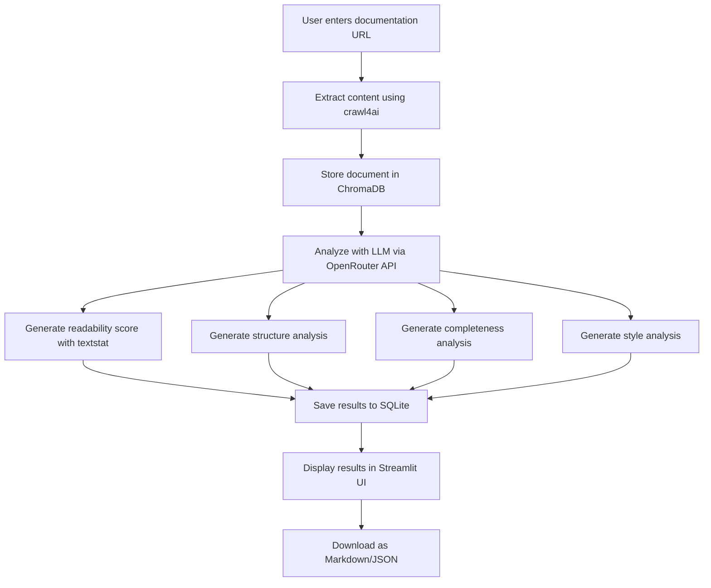

# 📘 MoEngage Documentation Improver

An AI-powered application that analyzes documentation articles and provides actionable improvement suggestions for technical writers and content creators.


## 🚀 Features

- **📊 Readability Analysis**: Evaluates text readability from a non-technical marketer's perspective using Flesch Reading Ease scores
- **🔄 Structure Assessment**: Analyzes document organization, headings, and flow for better user comprehension
- **📋 Completeness Check**: Verifies if the documentation provides sufficient information and examples
- **✒️ Style Guide Adherence**: Checks if the content follows Microsoft Style Guide best practices for technical writing

## 🛠️ Tech Stack

| Technology | Purpose |
|------------|---------|
| Streamlit | Web application framework for the user interface |
| OpenRouter API | LLM integration for AI-powered analysis |
| SQLite | Storing session data and analysis results |
| ChromaDB | Vector database for storing document content and semantic search |
| crawl4ai | Web content extraction from documentation URLs |
| textstat | Text readability scoring and analysis |

## 📁 Project Structure

```
AGENT_1/
├── app.py              # Main Streamlit application entry point
├── analyzer.py         # Document analysis logic and LLM integration
├── database.py         # Database operations (SQLite and ChromaDB)
├── extractor.py        # Web content extraction functionality
├── ui.py               # UI components and rendering functions
└── README.md           # Project documentation
```

## 🗄️ Data Architecture

### Storage Strategy

| Data Type | Storage Solution | Purpose |
|-----------|-----------------|---------|
| Session metadata | SQLite | Store analysis session IDs, URLs, and results |
| Document content | ChromaDB | Store extracted document text with vector embeddings |
| Analysis results | SQLite | Store detailed analysis of readability, structure, completeness, and style |

### Session Management

Each analysis creates a unique session ID (UUID) that links:
1. The document URL being analyzed
2. The extracted content stored in ChromaDB
3. The analysis results stored in SQLite

This architecture allows for:
- Retrieving past analyses without re-processing
- Comparing analyses across time
- Building a knowledge base of documentation quality patterns

## 🔧 Setup

1. Clone the repository
2. Install dependencies:
   ```bash
   pip install -r requirements.txt
   ```
3. Create a `.env` file with your OpenRouter API key:
   ```
   OPENROUTER_API_KEY="your-api-key-here"
   ```
4. Run the application:
   ```bash
   streamlit run app.py
   ```

## 🔄 How It Works



## 📊 Analysis Criteria

### 1. Readability for Marketers
Assesses how easily a non-technical marketer can understand the content, using the Flesch Reading Ease score and qualitative analysis.

### 2. Structure and Flow
Evaluates the organization of the document, including headings, subheadings, paragraph length, and logical flow.

### 3. Completeness of Information
Checks if the document provides enough detail and examples to understand and implement the feature or concept.

### 4. Style Guide Adherence
Analyzes the content against Microsoft Style Guide principles, focusing on voice and tone, clarity and conciseness, and action-oriented language.

## 📱 UI Sections

| Section | Purpose |
|---------|---------|
| Home | Enter URLs for analysis |
| Results | View detailed analysis with tabs for each criterion |
| History | Browse past analyses with option to reload |
| Sidebar | Navigation, API status, and recent sessions |

## 📖 License

This project is licensed under the MIT License - see the LICENSE file for details.

## 👥 Contributing

Contributions are welcome! Please feel free to submit a Pull Request.